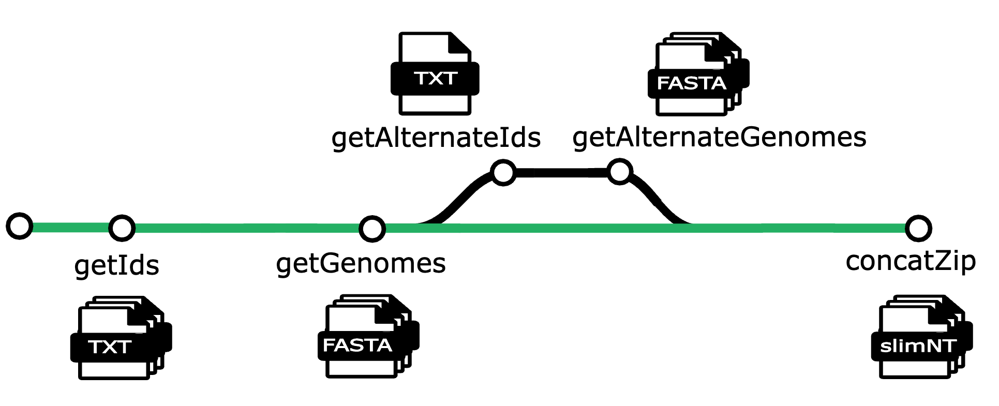

# slimNT

slimNT has been developed to provide a curated, streamlined version of the NT database. Metagenomic analysis can be difficult and time consuming when querying against the 368001 genomes in NT, and the necessary indexing step is resource heavy; both time and computationally. slimNT aims to ##solve## that problem by strategically sub setting the NT database to create a compact, user-defined database that is tailored to specific needs.

The slimNT database is derived from Representative Proteome (RPs) and Reference Proteome Groups (RPGs) provided by [Protein Information Resource (PIR)](https://proteininformationresource.org/rps/). Reference proteomes and viral reference proteomes can be selected based on a desired cutoff thresholds. Selecting a higher cutoff value will create a larger, more robust database that will lend to increased accuracy at the expense of computation time. Conversely, selecting a lower threshold will result in a database that can be queried more quickly, but may only identify more distantly related sequences.

To ensure a portable, reproducible workflow, a nextflow pipeline was developed to aggregate and build the slimNT database. Detailed instructions to install nextflow can be found here https://www.nextflow.io/docs/latest/index.html. 

## Data Collection

A list of non-viral proteome ids are generated from PIR. Cut-off values of [(75%)](https://proteininformationresource.org/rps/data/current/75/rpg-75.txt), [(55%)](https://proteininformationresource.org/rps/data/current/55/rpg-55.txt), [(35%)](https://proteininformationresource.org/rps/data/current/35/rpg-35.txt), and [(15%)](https://proteininformationresource.org/rps/data/current/15/rpg-15.txt). These options will result in 18614, 11895, 6072, and 1989 RPGs respectively. 

A list of viral proteome ids are generated similarly. Cut-off values of [(95%)](https://proteininformationresource.org/rps/viruses/data/current/95/rpg-95.txt), [(75%)](https://proteininformationresource.org/rps/viruses/data/current/75/rpg-75.txt), [(55%)](https://proteininformationresource.org/rps/viruses/data/current/55/rpg-55.txt), [(35%)](https://proteininformationresource.org/rps/viruses/data/current/35/rpg-35.txt), [(15%)](https://proteininformationresource.org/rps/viruses/data/current/15/rpg-15.txt), resulting in 15502, 10256, 7971, 6334, 4689 RPGs. 

There is a secondary group of viral RPGs that include polyproteomes that can be found [here](https://proteininformationresource.org/download/rps/rpg_virus_all/current/).

UniProt provides a dataset that can be used to map proteome ids to their associated Genbank or RefSeq IDS [(mapping dataset)](https://www.uniprot.org/proteomes?query=*) . 

This version of slimNT was designed to be as diverse and robust as possible, and the highest cut-offs were selected (95% cut-off for viral RPGs including polyproteomes, and 75% cut-off for all others.)

## Pipeline

### 1) getIds
The process **getIds** downloads a mapping file from UniProt and parses out proteome ids and genome assembly ids for all selected proteomes. The viral and non-viral representative proteome list files are then downloaded from PIR and the selected representative proteomes are extracted. **getIds** then matches proteome and assembly ids and outputs a mapping file mapped.db. 

### 2) getGenomes
The process **getGenomes** takes the mapped.db output of **getIds** as an input and downloads the assembly summary file from NCBI and extracts the FASTA genome assemblies. **getGenomes**  includes error handling steps, and will identify genomes that were not properly downloaded. This will account for broken urls that cause the download of a particular assembly to fail, but also in the event that the download is successful but the assembly summary file does not include a fasta file. **getGenomes** will output a directory of .fna files as well as a .txt file containing a list of all assembly Ids that were not successfully downloaded. 

### 3) getAlternateIds
The process **getAlternateIds** downloads an assembly summary file from NCBI and extracts matched RefSeq and Genbank assembly ids. **getAlternateIds** then reads the .txt file of missing .fna files output by **getGenomes** and identifies the alternate assembly. For example, if an error occurs with a RefSeq assembly file, this process will identify the matched Genbank file. **getAlternateIds** outputs a .txt file containing a list of alternate assembly ids.

**Note:** **getAlternateIds** and the downstream **getAlternateGenomes** will only execute if **getGenomes** identifies genome assemblies that were not successfully downloaded. 

### 4) getAlternateGenome
The process **getAlternateGenomes** takes the .txt output by **getAlternateIds** and repeats the process of **getGenomes**. **getAlternateGenomes** will output any newly downloaded .fna files as well as a second list of genomes that were not successfully downloaded. 

### 5) concatZip
The process **concatZip** takes all previously downloaded .fna files as input, concatenates and then compresses the concatenated database file. **concatZip** also takes the two .txt files containing genomes that were not successfully downloaded and combines them into a single list.

**Note:** The pipeline has been updated to include version control. These scripts can be found in the folder 'version_and_separate_compression' under the pipeline folder in this GitHub. The scripts have also been updated to have the capability to compress the database separately from the rest of the pipeline. This script is step #6, **6_compress_files.sh**. Those updated scripts will be found in the folder under 'version_and_separate_compression' under the pipeline folder in this GitHub.

# Steps to run slimNT
The slimNT scripts can be found 
1. To run the slimNT pipeline simply write the command **sbatch run_pipeline.sh --version 1.2436** in the command line.
   - The version flag must be used in order to run the code successfully. The version number will appear after the _ in the filename ex : slimNT_##.fa
2. Use slurm commands to analyze and monitor the computation: squeue, sstat, or sacct
3. Genomes that did not map will be found in the file **missing_fna.txt** in this location: **/scratch/hivelab/slimNT-sean/slimNT/output**
4. The database file, **slimNT_##.fa** is created from the run_pipeline.sh file. In order to compress the database file, use **run_compression.sh**:
    - sbatch run_compression.sh --version 1234
5. The outputs of this pipeline is **slimNT_version.fa** and **slimNT_version.fa.gz** in the filepath: **/scratch/hivelab/slimNT-sean/slimNT/output**

# Steps to Run the Pipeline on GW HPC
1. Gain access to the GW HPC Pegasus server. To gain access fill out the form on this [GW HPC help site](https://it.gwu.edu/high-performance-computing-access-request)
2. Once you have access to this pegasus server and you are logged in, navigate to this filepath **/scratch/hivelab/slimNT-sean/slimNT**
3. To run the slimNT pipeline simply write the command **sbatch run_pipeline.sh --version 1.2436** in the command line.
   - The version flag must be used in order to run the code successfully. The version number will appear after the _ in the filename ex : slimNT_##.fa
5. Use slurm commands to analyze and monitor the computation: squeue, sstat, or sacct
6. Genomes that did not map will be found in the file **missing_fna.txt** in this location: **/scratch/hivelab/slimNT-sean/slimNT/output**
7. The database file, **slimNT_##.fa** is created from the run_pipeline.sh file. In order to compress the database file, use **run_compression.sh**:
    - sbatch run_compression.sh --version 1234
9. The outputs of this pipeline is **slimNT_version.fa** and **slimNT_version.fa.gz** in the filepath: **/scratch/hivelab/slimNT-sean/slimNT/output**

Note: If you are viewing the code scripts, make sure to use Nano or Cat. Vi hides the slurm controllers at the top of the scripts.

## White List Capability
The pipeline has the capability to take in a white list file of wanted additional organisms. This is is implemented and performed in the file for step 1, **1_get_ids.sh**. 
- To create the white list, enter the names of the organisms of interest in a .txt file. Each name should be its own row, no commas or semi-colons, and no spaces after the name.
- In line 16 in the script **1_get_ids.sh**, make sure that the name of your file is entered here and associated with the variable _WHITELIST_FILE_.
- If a whitelist file was not given, a default list is there beginning at line 17. This default list can be updated as well. 

