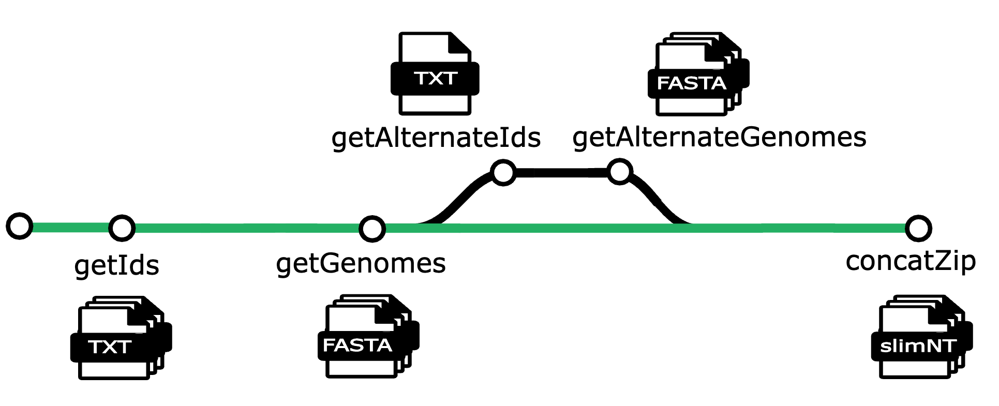

# slimNT

slimNT has been developed to provide a curated, streamlined version of the NT database. Metagenomic analysis can be difficult and time consuming when querying against the 368001 genomes in NT, and the necessary indexing step is resource heavy; both time and computationally. slimNT aims to ##solve## that problem by strategically sub setting the NT database to create a compact, user-defined database that is tailored to specific needs.

The slimNT database is derived from Representative Proteome (RPs) and Reference Proteome Groups (RPGs) provided by [Protein Information Resource (PIR)](https://proteininformationresource.org/rps/). Reference proteomes and viral reference proteomes can be selected based on a desired cutoff thresholds. Selecting a higher cutoff value will create a larger, more robust database that will lend to increased accuracy at the expense of computation time. Conversely, selecting a lower threshold will result in a database that can be queried more quickly, but may only identify more distantly related sequences.

To ensure a portable, reproducible workflow, a nextflow pipeline was developed to aggregate and build the slimNT database. Detailed instructions to install nextflow can be found here https://www.nextflow.io/docs/latest/index.html. 

## Contact Us
To contact us about any questions or feedback, please email us at mazumder_lab@gwu.edu

## Data Collection

A list of non-viral proteome ids are generated from PIR. Cut-off values of [(75%)](https://proteininformationresource.org/rps/data/current/75/rpg-75.txt), [(55%)](https://proteininformationresource.org/rps/data/current/55/rpg-55.txt), [(35%)](https://proteininformationresource.org/rps/data/current/35/rpg-35.txt), and [(15%)](https://proteininformationresource.org/rps/data/current/15/rpg-15.txt). These options will result in 18614, 11895, 6072, and 1989 RPGs respectively. 

A list of viral proteome ids are generated similarly. Cut-off values of [(95%)](https://proteininformationresource.org/rps/viruses/data/current/95/rpg-95.txt), [(75%)](https://proteininformationresource.org/rps/viruses/data/current/75/rpg-75.txt), [(55%)](https://proteininformationresource.org/rps/viruses/data/current/55/rpg-55.txt), [(35%)](https://proteininformationresource.org/rps/viruses/data/current/35/rpg-35.txt), [(15%)](https://proteininformationresource.org/rps/viruses/data/current/15/rpg-15.txt), resulting in 15502, 10256, 7971, 6334, 4689 RPGs. 

There is a secondary group of viral RPGs that include polyproteomes that can be found [here](https://proteininformationresource.org/download/rps/rpg_virus_all/current/).

UniProt provides a dataset that can be used to map proteome ids to their associated Genbank or RefSeq IDS [(mapping dataset)](https://www.uniprot.org/proteomes?query=*) . 

This version of slimNT was designed to be as diverse and robust as possible, and the highest cut-offs were selected (95% cut-off for viral RPGs including polyproteomes, and 75% cut-off for all others.)

## Pipeline



### 1) getIds
The process **getIds** downloads a mapping file from UniProt and parses out proteome ids and genome assembly ids for all selected proteomes. The viral and non-viral representative proteome list files are then downloaded from PIR and the selected representative proteomes are extracted. **getIds** then matches proteome and assembly ids and outputs a mapping file mapped.db. 

### 2) getGenomes
The process **getGenomes** takes the mapped.db output of **getIds** as an input and downloads the assembly summary file from NCBI and extracts the FASTA genome assemblies. **getGenomes**  includes error handling steps, and will identify genomes that were not properly downloaded. This will account for broken urls that cause the download of a particular assembly to fail, but also in the event that the download is successful but the assembly summary file does not include a fasta file. **getGenomes** will output a directory of .fna files as well as a .txt file containing a list of all assembly Ids that were not successfully downloaded. 

### 3) getAlternateIds
The process **getAlternateIds** downloads an assembly summary file from NCBI and extracts matched RefSeq and Genbank assembly ids. **getAlternateIds** then reads the .txt file of missing .fna files output by **getGenomes** and identifies the alternate assembly. For example, if an error occurs with a RefSeq assembly file, this process will identify the matched Genbank file. **getAlternateIds** outputs a .txt file containing a list of alternate assembly ids.

**Note:** **getAlternateIds** and the downstream **getAlternateGenomes** will only execute if **getGenomes** identifies genome assemblies that were not successfully downloaded. 

### 4) getAlternateGenome
The process **getAlternateGenomes** takes the .txt output by **getAlternateIds** and repeats the process of **getGenomes**. **getAlternateGenomes** will output any newly downloaded .fna files as well as a second list of genomes that were not successfully downloaded. 

### 5) concatZip
The process **concatZip** takes all previously downloaded .fna files as input, concatenates and then compresses the concatenated database file. **concatZip** also takes the two .txt files containing genomes that were not successfully downloaded and combines them into a single list.

#### Note:
The pipeline has been updated to include _version control_. These scripts can be found in the folder [version_and_separate_compression](https://github.com/GW-HIVE/slimNT/tree/main/pipeline/version_and_separate_compression) under the pipeline folder in this GitHub. The scripts have also been updated to have the capability to compress the database _separately_ from the rest of the pipeline to improve efficiency. This script is step #6, **6_compress_files.sh**. Those updated scripts will be found in the folder under 'version_and_separate_compression' under the pipeline folder in this GitHub.

# Steps to Run slimNT
The slimNT scripts can be found in the [Pipeline](https://github.com/GW-HIVE/slimNT/tree/main/pipeline) folder. The original files, no version control, use the code scripts found in the root of the pipeline directory. To use versioned files, the scripts are found in the folder [version_and_separate_compression](https://github.com/GW-HIVE/slimNT/tree/main/pipeline/version_and_separate_compression). Whitelist capabaility (explained below) is embedded in both sets of the code. 

## Set up your environment

Clone the repository and ensure the following are available on your `PATH`:

- `bash` (4.0+)
- `python3`
- `wget`, `curl`
- `gzip`, `unzip`

You will need a destination directory with at least **500 GB** of free space for the output. The pipeline creates that directory (and all logs inside it) automatically.

## Run the Pipeline

```bash
bash run_pipeline.sh -o /path/to/output
```

Optional: provide a local backup directory of previously downloaded genome ZIPs to avoid re-downloading:

```bash
bash run_pipeline.sh -o /path/to/output --backup-dir /path/to/backup
```

The pipeline validates write access and available disk space before starting, then runs all six steps in sequence. Progress is written to stdout; detailed per-step logs are written to `/path/to/output/logs/`.

Outputs:
- **`/path/to/output/slimNT.fa`** — concatenated genome FASTA
- **`/path/to/output/missing_fna.txt`** — assembly IDs that could not be downloaded
- **`/path/to/output/logs/fallback_retrieval.jsonl`** — structured log of nucleotide fallback attempts

## White List Capability
The pipeline has the capability to take in a white list file of wanted additional organisms. This is is implemented and performed in the file for step 1, **1_get_ids.sh**. 

- To create the white list, enter the names of the organisms of interest in a .txt file. They should be in your slimNT directory you have created. Each name should be its own row, no commas or semi-colons, and no spaces after the name.
   * The names should be the Organism name as it is found on UniProt. For example, if you want UP000000625 the name should be Escherichia coli (strain K12)
- In line 16 in the script **1_get_ids.sh**, make sure that the name of your file is entered here and associated with the variable _WHITELIST_FILE_.
- If a whitelist file was not given, a default list is there beginning at line 17. This default list can be updated as well.
- If you create a new file, make sure the name of the text file matches would is in the code when it is being called. Right now it is listed as _eukaryotes_whitelist.txt_.

